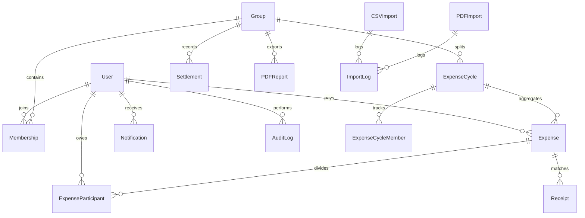

# Splitly — Scope & Anomaly Log (SCOPE.md)

This log details the data anomalies found in incoming transaction files (CSV/PDF) and how Splitly resolves them, followed by our normalized database schema.

---

## 🛠️ CSV & PDF Anomaly Log

When users upload transaction files, the Splitly ingestion engine processes rows and checks for anomalies. If any of the following data validation issues are encountered, they are logged as anomalies in the database with a clear explanation and suggested action. The user must review and explicitly approve or reject these before import execution.

| Anomaly Type | Problem Found | Mitigation & Handling Strategy |
|---|---|---|
| **`ZERO_AMOUNT`** | Amount is equal to zero. | Flagged as an anomaly. The user must verify the transaction. In most cases, these are rejected unless representing an intentional zero-sum adjustment. |
| **`NEGATIVE_AMOUNT`** | Amount is negative (e.g. `-150.00`). | Flagged as an anomaly. Splitly blocks direct negative expenses and suggests rejecting, since negative expenses should be recorded as settlements or refunds. |
| **`INVALID_CURRENCY`** | Currency is not in `[INR, USD, EUR, GBP, AED]`. | Row is flagged as an anomaly. The user can manually edit or choose to reject. Splitting is blocked until a supported currency is set. |
| **`INVALID_DATE`** | Date format is unparseable or date is in the future. | Row date defaults to `today`. If in the future, it is flagged as an anomaly and requires confirmation (e.g., pre-scheduled expenses). |
| **`SETTLEMENT`** | Description contains payment keywords (e.g., "settlement", "repaid", "paid back"). | Flagged as an anomaly. It is suggested to reject the row and record it under the **Settlements** module instead, keeping expenses separate from settlement payments. |
| **`REFUND`** | Description contains credit keywords (e.g., "refund", "credit", "cashback"). | Flagged as an anomaly. The user is prompted to reject if it is a transaction refund rather than a group expense. |
| **`DUPLICATE`** | Duplicate entry found in the database or within the uploaded file. | **Smart Matching Rule**: Flagged if there is an existing transaction in the group with an amount difference within ±1, date proximity within ±3 days, and a title word overlap of ≥50%. User is warned to reject to prevent double-counting. |
| **`PARTICIPANT_ERROR`**| Listed participant email is not in the group. | Flagged as an anomaly. Falls back to splitting among active members or alerts the user to register the member. |
| **`MEMBER_CONFLICT`** | Transaction date falls outside a member's active timeline. | Flagged as an anomaly. Ensures splits are only allocated to members who were active in the group when the expense occurred. |
| **`MISSING_VALUES`** | Missing required columns (e.g. empty amount or title). | Flagged as an anomaly. User can either manually supply the missing data or reject the row. |

---

## 🗄️ Database Schema

The SQLite/PostgreSQL database uses normalized tables representing users, groups, memberships, expense cycles, individual expenses, participants, currency exchanges, settlements, imports, and logs.

### Table Definitions
1. **`User` (AbstractUser)**: Extended custom user model.
   - `email` (Unique String), `phone_number` (String), `preferred_currency` (Choice: INR/USD/EUR/GBP/AED).
2. **`Profile`**: One-to-one user details.
   - `user` (FK User), `phone_number` (String), `preferred_currency` (String), `profile_picture` (Image), `bio` (Text).
3. **`Group`**: Shared spaces.
   - `name` (String), `description` (Text), `created_at` (DateTime), `created_by` (FK User), `is_archived` (Bool), `is_deleted` (Bool).
4. **`Membership`**: Tracks active members.
   - `group` (FK Group), `user` (FK User), `join_date` (DateTime), `leave_date` (DateTime), `status` (Active/Inactive).
5. **`ExpenseCycle`**: Segments group logs into distinct check periods.
   - `group` (FK Group), `start_date` (DateTime), `end_date` (DateTime), `status` (Active/Closed).
6. **`Expense`**: Individual items.
   - `cycle` (FK Cycle), `title` (String), `amount` (Decimal), `currency` (String), `exchange_rate` (Decimal), `converted_inr_value` (Decimal), `date` (Date), `category` (Choice), `paid_by` (FK User), `split_type` (Choice), `receipt` (Image), `is_deleted` (Bool).
7. **`ExpenseParticipant`**: Split records.
   - `expense` (FK Expense), `user` (FK User), `amount` (Decimal), `amount_inr` (Decimal), `input_value` (Decimal).
8. **`Currency`**: Live exchange rates database.
   - `currency` (String, Unique), `rate_to_inr` (Decimal), `updated_at` (DateTime), `updated_by` (FK User).
9. **`Settlement`**: Debts cleared.
   - `group` (FK Group), `payer` (FK User), `receiver` (FK User), `amount` (Decimal), `currency` (String), `date` (Date).
10. **`CSVImport` / `PDFImport`**: Import session trackers.
    - `group` (FK Group), `uploaded_by` (FK User), `file_name` (String), `status` (Pending/Reviewing/Completed/Cancelled), `total_rows` (Int), `imported_rows` (Int).
11. **`ImportLog`**: Details anomalies for each row.
    - `import_session` (FK CSVImport), `pdf_import_session` (FK PDFImport), `source` (CSV/PDF), `row_number` (Int), `raw_data` (JSON), `status` (Valid/Anomaly/Skipped/Imported), `anomaly_type` (Choice), `anomaly_explanation` (Text), `user_decision` (Approve/Reject).
